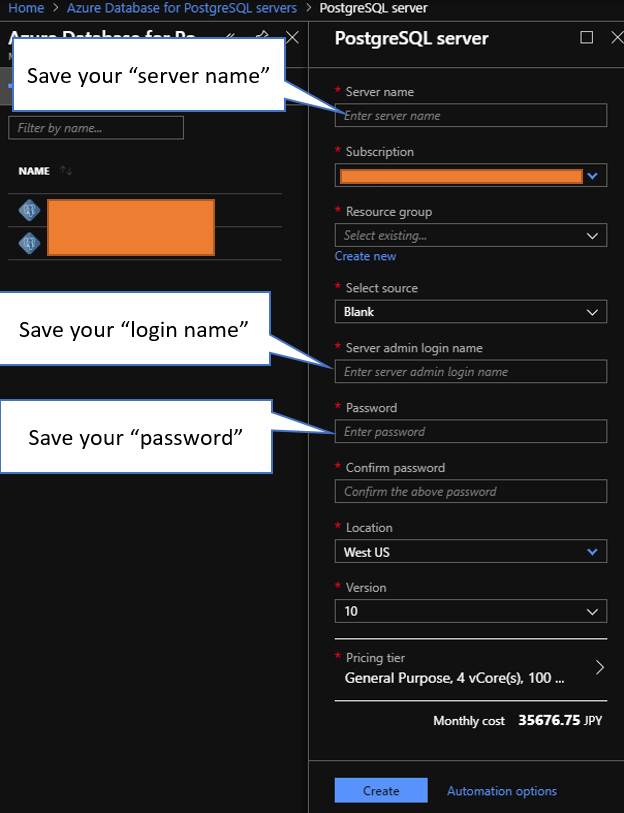
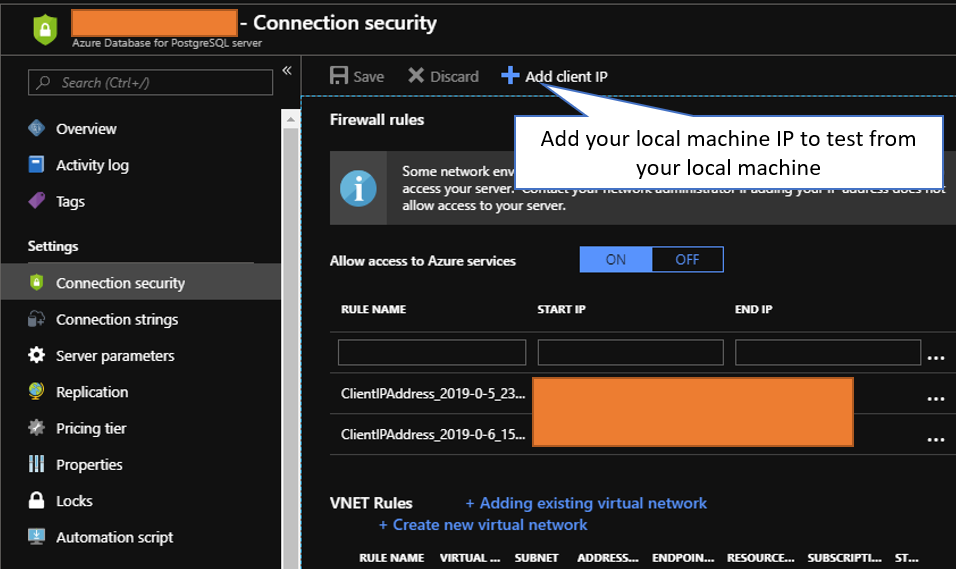
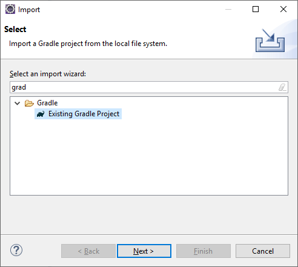
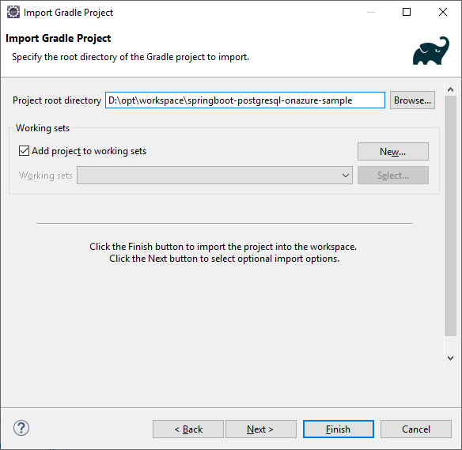
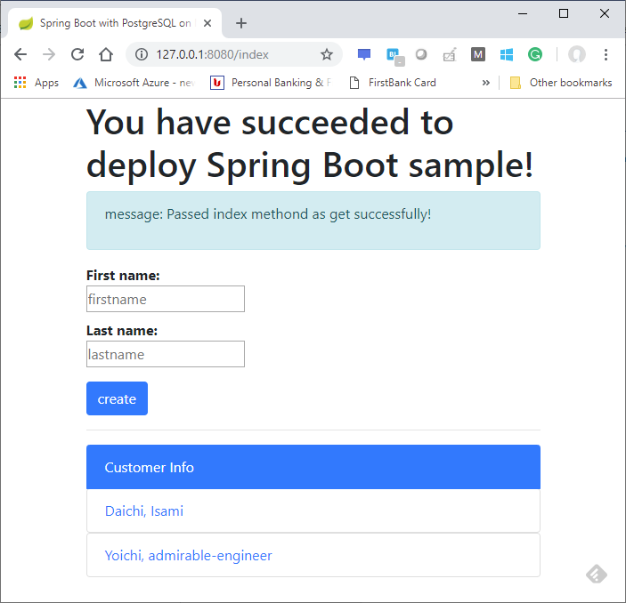
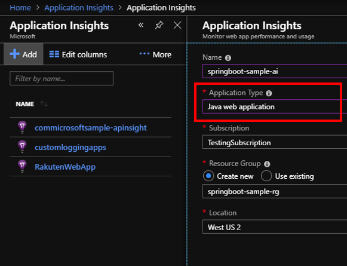
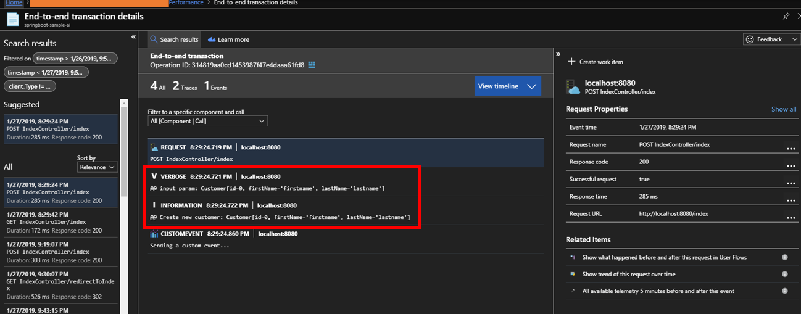

# springboot-postgresql-onazure-sample
You can manage Azure Database for PostgreSQL with Spring Boot by using this sample.

## Requirement
- JDK 1.8
- Gradle 5.1.1
- Eclipse
- Microsoft Azure subscription

## How to setup this sample - simple execution on your local machine 

Create your Azure Database for PostgreSQL instance like below. Note to save your "server name", "login name" and "password" to setup your Spring Boot sample later.


Add your local machine IP address into allow list of your PostgreSQL instance like below if you want to test from your machine. 


Let's git clone or downlaod this sample and import this sample into your Eclipse workspace like below.



Update "springboot-postgresql-onazure-sample\src\main\resources\application.properties" to access your PostgreSQL instance properly.

````

spring.jpa.show-sql=true
spring.jpa.hibernate.ddl-auto=create-drop
spring.jpa.properties.hibernate.temp.use_jdbc_metadata_defaults=false
spring.datasource.driverClassName=org.postgresql.Driver
spring.datasource.url=jdbc:postgresql://[server-name].postgres.database.azure.com:5432/postgres
spring.datasource.username=[login-name]@[server-name]
spring.datasource.password=[password]

````

Now, you can execute your Spring Boot sample like below! You can add your customers by input firstname and lastname.


## How to setup this sample - execution with Application Insights on your local machine (Optional)
Create Application Insights instance like below on Microsoft Azure portal. Don't forget to specify "Application Type" as "Java web application".



And pick up your instrumentation-key to specify your application. Next, update "springboot-postgresql-onazure-sample\src\main\resources\application.properties" to store log data into your Application Insight instance like below.

````

## Configuration for Application Insights 
azure.application-insights.instrumentation-key=[your ikey from the resource]
# Specify the name of your springboot application. This can be any logical name you would like to give to your app.
spring.application.name=[your app name]


````

Then, you can find your log data on Microsoft Azure portal like below.


## References
- https://github.com/akraskovski/spring-boot-postgresql-gradle
- Configure a Spring Boot Initializer app to use Application Insights https://docs.microsoft.com/en-us/java/azure/spring-framework/configure-spring-boot-java-applicationinsights?view=azure-java-stable
- Explore Java trace logs in Application Insights https://docs.microsoft.com/en-us/azure/azure-monitor/app/java-trace-logs
